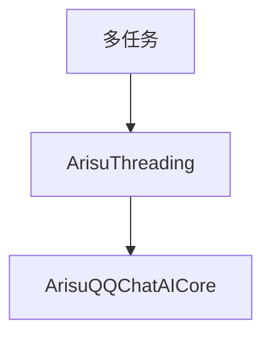

<div align="center">
  <h1 align="center">
   <br/>
   ArisuQQChatAI · 爱丽丝QQ聊天AI
  </h1> 
</div>

{: style="display:block; margin:auto; width:200px"}

<div align="center">
  <a href=https://github.com/yandifei/ArisuQQChatAI>
    喜欢的话，就给爱丽丝个✨Star✨吧！(ﾉ>ω<)ﾉ❤️
</div>


[TOC]

# 快速上手
- 获取deepseek的api密钥并配置
- 输入绑定配置并配置启动环境
- 注：QQ的UI和现在的不同，但是功能一样。

## 密钥获取
密钥获取(懂的可以跳过)

**这里就不浪费口舌讲API密钥有什么用？为什么需要API密钥的问题了(总而言之：这东西要钱)。**

**官方API：https://platform.deepseek.com/**

以下均为作者的实际操作(官网更新可能导致与实际有点不同，出现不同可询问AI、查阅资料、B站搜索等完成操作)
- 核心要点: 1.拿到密钥 2. 进行充值 (1元)
```markdown
1. 浏览器打开DeepSeek开放平台:https://platform.deepseek.com/
2. 使用手机号进行登录(微信也行，只要登录进入就行)
3. 登录进去后看到最左边就是 用量信息 选项
4. 点击 去充值按钮
5. 到这一步需要实名认证
6. 完成实名后就进行充值，冲多少完全看个人，我冲1元(自己一个人使用能玩一天)
    具体可以去官网查看定价(https://api-docs.deepseek.com/quick_start/pricing)
7. 充值完成后在最左侧点击 API keys 选项，点击 创建 API key 选项
8. 给这个API取名，名字自定义的但是取好后就不能修改了，除非你把整个密钥给删了重新创建。
    我这个密钥是拿来扮演爱丽丝人设进行对话的，所以我就取名 爱丽丝 了
9. 创建完成后会弹出一个提示界面，记得点击复制，一定要把密钥复制下来，不然就没机会复制了。
    如果这一步你没有复制那就把刚刚生成的密钥删了，回到第7步
10. 把你复制下来的密钥暂时粘贴到你保存学习资料的地方(放到除了你没人能看到的地方就行)
    粘贴到 爱丽丝QQ聊天AI.exe的密钥输入框 就可以删除了。
```

## Q群准备
这一步骤非常必要，不搞定后面的都无法进行。
1. 打开并登陆QQ，设置中在点击“超级调色盘”把主题选择为“极简。（登陆的账号新手强烈建议使用小号，这个账号将作为机器人账号使用）
2. 把Q群单独拉出来用，如下图：
{: style="width: 30%; height: 20%;"}

## 信息填写

如上图展示中我已经录入了5个Q群的信息，所以正常界面应该是`需要回复的QQ群`下面的表格为空。

### Q群名填写
填写你需要进行AI回复的Q群名：优先填Q群的备注名，如果没有备注名就填Q群名。

***控制的窗口名字不能有相同的，即多个Q群左上角的名字不能相同。***

- 强烈建议优先使用备注名


### 机器人名字
填你在Q群中的名字就行了，比如下图位置的名字


### 最高权限者
填你在Q群的另一个号。这个账号会作为机器人账号，所以你最好填Q群中另一个自己的号，和机器人共用一个账号会非常突兀。

当然，你也可以填机器人名字，这样最高权限者就是机器人账号，最高级的指令之后机器人账号能用。

如果你填QQ群主或管理员就意味着这个机器人账号，也就是这个AI完全受他人摆布。

如下图红框的位置就是你要填的

### 退出指令的密码
这个密码你可以随便填，**忘记了也完全没有关系**，因为你每次启动AI回复的时候可以直接重置。这个密码本质就是最高级权限指令的密码，比如`#退出:填你设置的密码`。

### 初始人设
不填默认爱丽丝，人设在用户设置的提示库目录下，可以通过设置界面直接到达。在这个目录中你可以自行修改人设，这意味着你完全可以自定义一个你想要的人设。因为时间问题我没法写`RAG`这部分代码来塑造更加完美的人设，考虑到AI的“永久记忆”和“联网搜索”需要部署`Docker Desktop`，我便放弃了这个技术撰写（理由是背离项目的根本理念：开箱即用）。

### Q群窗口的位置
不填默认0,0。
这个部分作者认为并不困难，但是对用户来说这部分需要有计算就显得困难重重了。
**1.1.0版本之后已经支持Q群位置计算了**，多Q群窗口控制、多窗口的位置计算、多窗口的位置计算的内容感兴趣可以看，没兴趣直接跳过。
如果你只想要监控一个窗口就直接不填使用默认值`0,0`。

#### Q群位置获取
为了方便使用者**多Q群窗口控制**，`1.1.0`版本之后增加了`Q群位置计算`按钮，输入Q群名后点击该按钮就能自动计算边缘可以直接使用的位置了。


***注：这些位置是最大化利用窗口边缘的（为了好看和2懒得计算），实际上窗口不能完全重叠在一起（2个窗口完全重合会无法监听消息），但是窗口可以进行堆叠。也就是实际上`Q群位置计算`按钮给出的位置远远不止这么少！！！***

#### 多Q群窗口控制
如下图使用QQ截图功能，其中中左上角`728*728`就是这一个窗口的大小了。


使用QQ截图获取整个桌面窗口的大小，如图实例中的屏幕显示的是`2560*1440`的窗口大小，这个屏幕大小也就是限制一个桌面窗口最多有多少个Q群。


#### 多窗口的位置计算
例如从上面窗口拿到的窗口大小是`728*728`，那么第一个窗口的位置计算如下：
```letex
第一个窗口位置 = -窗口横坐标大小 + 1 , -窗口纵坐标大小 + 1

示例：
第一个窗口的位置 = -728 + 1，-728 + 1
                = -727，-727
```

第二个窗口位置：
```letex
第二个窗口位置 = -窗口横坐标大小 + 1，2

示例：
第二个窗口位置 = -728 + 1，2
                = -727，2
```

第三个窗口位置，这第三个窗口位置必须根据第二个窗口位置来计算：
```letex
第三个窗口位置 = -窗口横坐标大小 + 1，2 + 窗口纵坐标大小

示例：
第三个窗口位置 = -728 + 1，2 + 728
                = -727，730
```

以此类推，只要不超过整个屏幕的大小就行。示例不超过`2560*1440`就行。

## 启动AI自动回复
填好Q群信息后点击`开启自动回复`按钮（或者通过快捷键或主页的一键启动）。


***

# 权限系统
- **因为此项目并不是最好的Bot（它的上限确实摆在那里，所以设置“完美”的权限系统确实没有任何意义。）**

1. 对于退出指令即使是超管也必须要密码（别人可以通过修改和你相同的备注名获得和你等同的权限）。

2. 可以在初始化时把`移除危险指令`的选项打开，仅加载限制指令。
   1. 相比于之前的指令系统，这部分指令是独立加载的，之前是全部加载后通过检查指令是否在危险指令列表实现的，也就是每次使用指令的时候都要检查是否开启了移除危险指令限制和去危险指令列表里面查找是否为危险指令。
   2. 事实上，`危险指令`也是它功能多样性的体现，移除确实少了非常实用的特性(如`人设切换`)。

## 权限分级
- 这里将对以往的指令做出更改：`#开启权限隔离`改为`#开启指令权限限制`、`#关闭权限隔离`改为`#关闭指令权限限制`

### **超级管理员（root）：**

只能有一个，自己(自己在群里的非机器人账号)或机器人账号

权限功能：（简单了当就是可以使用所有指令，下面列举的不用看了，作者自己看的。）
1. 拥有使用`#退出`指令的权限(退出指令还需要密码)。
2. 拥有`#开启指令权限限制`和`#关闭指令权限限制`的功能。
3. 其他指令功能

</br>
爱丽丝QQ聊天AI/UI
### **管理员(administrators)：**
Q群的群主和Q群的管理员，之前的应该有个bug：检测不到管理员或群主无法录入就崩溃，在这里将进行重写修复。

权限功能：（除了退出指令以外的所有指令）
1. 拥有`#开启指令权限限制`和`#关闭指令权限限制`的指令。
2. 除了`#退出`的其他指令

### **其他人(other)**：

普通群友

权限功能：（除了退出指令和权限隔离指令以外的所有指令）
1. 基础对话。
2. 无限制指令的调用

***
# 指令系统
为了方便上手，划分为无限制指令和限制指令
`limit`:限制指令

## 所有指令
1. 帮助之类的指令
    #帮助
    #指令查询
2. 权限管理指令
    #超管(`limit`)
    #所有管理员(`limit`)
    #开启指令权限限制(`limit`)
    #关闭指令权限限制(`limit`)
3. 额外指令
    #jm（下载禁漫的指令）(`limit`)
    #图片映射表的键（具体见下文，作用是批量下载图片）
4. 远程控制指令
    #中控截图(`limit`)
    #运行时间(`limit`)
    #系统资源监控(`limit`)
5. 特殊指令
    #兼容(`limit`)
    #测试接口(`limit`)
    #初始化(`limit`)
6. 对话参数调节指令
    #模型切换
    #V3模型
    #R1模型
    #评分
    #最大token数(`limit`)
    #输出格式(`limit`)
    #敏感词(`limit`)
    #删除敏感词(`limit`)
    #流式(`limit`)
    #非流式
    #开启请求统计(`limit`)
    #关闭请求统计(`limit`)
    #温度(`limit`)
    #核采样(`limit`)
    #工具列表(`limit`)
    #工具开关(`limit`)
    #开启对数概率输出(`limit`)
    #关闭对数概率输出(`limit`)
    #位置输出概率(`limit`)
7. FIM对话参数指令
    #FIM对话
    #FIM补全开头
    #FIM完整输出
    #FIM对数概率输出(`limit`)
    #FIM补全后缀
8. 上下文参数
    #思维链
    #对话轮次(`limit`)
    #聊天记录(`limit`)
    #清空对话历史
9.  多人设管理指令
    #人设切换(`limit`)
    #所有人设(`limit`)
    #人设查询(`limit`)
    #当前人设(`limit`)
    #人设自定(`limit`)
    #删除人设(`limit`)
10. 场景关键词自动调控参数指令
    #代码
    #数学
    #数据
    #分析
    #对话
    #翻译
    #创作
    #写作
    #作诗
11. 余额和token数查询
    #余额
    #token

***

# 图片映射表
`@机器人名字 下面json的键`就能够调用他们的api下载图片并发送了。

默认配置了5个随机图片的API，相比以前：
1. 以前的图片主题不稳定，这里进行了改善。
2. 对于安全性，用上网络爬虫的headers构造和超时处理(以前没学所以没写)
3. 拓展更新，这里直接把接口开发提供给用户修改，您可以直接修改里面的API和键(json的key)，实现有人@你时加上关键词(key)就能发送图片出去。

默认配置数据：
```json
{
    "ACG" : "https://www.loliapi.com/acg/pc/",
    "二次元" : "https://t.alcy.cc/moe",
    "手机壁纸" : "https://api.anosu.top/img",
    "白丝" : "https://acg.suyanw.cn/whitesilk/random.php",
    "黑丝" : "https://v2.xxapi.cn/api/heisi?return=302",
    "cos涩图" : "http://api.yujn.cn/api/cos.php",
    "猫娘壁纸" : "https://acg.suyanw.cn/mao/random.php"
}
```

**指令调用**
AI回复线程初始化时会把上面的配置数据(json)给自动收录进去做成指令。

如：`#ACG:10`、`#二次元:21`
`#ACG:10`是使用json中ACG对应的链接下载10张图片并发送
`#二次元:21`使用json中二次元对应的链接下载21张图片并发送

***注意：***
这条指令是启动一个新的线程下载，但是共用一个图片资源，如果多次调用(如连续调用`#ACG:10`和`#二次元:21`)会**导致发送顺序错乱**(不会造成死锁，我使用了with会强制回收资源，确保了多条图片批量下载指令当前仅有一个线程能使用该图片资源)
## 使用展示
以下是图片下载暴力测试以及下载过程中对AI调用影响的展示(图片均从公开api爬取，如有侵权通知立删)


## API收集
https://api.btstu.cn/
随机头像、随机壁纸、获取QQ昵称和头像、QQ电脑在线状态、QQ强制聊天

https://img.r10086.com/
樱道随机图片API接口

https://acg.suyanw.cn/
素颜随机二次元动漫API，图片API，文字API，二维码API，随心所动不再单调

https://www.dmoe.cc/
樱花二次元图片API-Dmoe

https://img.jitsu.top
Jitsuの随机涩图API

**后续也新加了一些其他的API接口，这里的文档以后就不写了，因为2.0.0版本后加入了函数回调能直接搜索下载发送指定主题的图片了！**
***


# 插件工具
**2.0.0版本后加入工具体系，可以通过工具让LLM(大语言模型)实现多模态**
## 时间插件
`get_current_time_and_calendar_info.py`
获取现在的年份, 月份, 日期, 小时, 分钟, 秒钟, 毫秒, 星期几, 星期, 秒级时间戳, 毫秒级时间戳,
公历日期, 农历日期, 农历年, 农历月, 农历日, 生肖, 天干地支, 是否为节假日, 节日名称, 是否为国际性节日, 二十四节气
## 图片插件
### 下载特定主题图片
插件文件：`download_images_for_a_specific_topic.py`
作用：沿袭了之前的图片发送指令，从用户自定义的api中抽取主题发送指定数量的图片
配置文件：`爱丽丝QQ聊天AI/用户设置/关键词回复/图片映射表.json`
### 从图片引擎中搜索下载图片
插件文件：`download_images_for_a_specific_topic.py`
作用：通过1个关键词下载并发送指定数量的图片，关键词没有被收录也会没有搜索结果
搜索引擎：亿图全景图库
API端点：https://www.yeitu.com/

****


# 感想
此项目是我对前后端分离的第一次认识，本来是用来给PyQt6练手的。
- 我个人认为其实软件已经够完善了，把鼠标移动到按钮上停顿一会(鼠标悬停)就会弹出提示，本该实在是没有必要写文档，但是文档也是软件的一部分。
- ***我也算是无愧于爱丽丝之名，既是魔王也是勇者。***

***

# 版本更新
## v1.0.0 - 首个测试版
完成了核心功能的编写和测试。
接下来要完善其他界面的功能。

## 1.0.0 UI美化、完成测试
快捷键界面和设置界面UI美化。
个人进行了部分输入注入渗透测试。
完成所有功能测试，基本完成键盘功能。

## 1.1.0 优化窗口线程、增加用户自定义
增加窗口线程自定义重启、重置时间。
增加窗口重启、重置时间用户配置自动保存功能。
文档完善，《爱丽丝QQ聊天AI》更详细的快速上手。
更修改软件图标背景为白色，桌面快捷方式更好看。

## 1.2.0 Q群位置计算、@系统bug修复、涩图发送
修复左侧头像互动时会@系统的bug
增加Q群位置计算功能，自动计算最大可用边缘位置
图片下载发送功能(用户自定义,默认黑丝、白丝、二次元等5个)

## 1.3.0 功能增加和Bug修复
**🐛 Bug 修复**
- ✅修复窗口重置时间无效⏰
- ✅退出指令的函数异常导致长时间工作崩溃的bug🛠️
- ✅使用指令后会@自己导致无止境自我回复的bug🔁
- ✅管理员获取不全的问题(最大化窗口读取去修复)👨💻
- ✅最高权限者和机器人同名无法调用限制指令的bug🚫
**⚡ 使用优化**
- ✅优化`#帮助`指令的内容📚
- ✅`#人设切换`指令自动清空对话历史🔄
- ✅爱丽丝Pro去除涩涩限制🎉（修改了人设库）
- ✅优化`#退出`指令使用后更加优雅的退出该线程而不是整个软件。👋
**🎉 新增功能**
- ✅软件界面截图发送(监控软件状态)📸
- ✅增加获取软件运行时间指令(监控软件运行时间，稳定性)⏳
- ✅QQ消息轮询时间自定义(如：每几秒检查一次QQ新消息)🔍
- ✅`#ACG:20`图片批量下载指令，图片下载发送采用线程方案，不影响AI回复🖼️🚀

## 1.4.0 仅支持新版QQ 🚀

**✨ 新功能**
- 重构控件解析引擎，QQ 9.9.23-41857 (64位)

**🐞 错误修复**
- 修复了“深度隐藏”功能生效时，系统托盘未随之隐藏的问题
- 系统托盘提示信息现已准确显示软件版本

**⚙️ 性能优化**
- 彻底优化消息发送流程：引入粘贴完成检测机制，避免因操作过快导致的消息截断！

## 2.0.0 - 多模态架构实现 ✨

**📌 QQ版本支持**
- 🎯 支持 QQ 9.9.23-41857 (64位)
- 🎯 支持 QQ 9.9.23-42086 (64位)

**🚀 核心架构升级**
- 🌟 全新多模态架构，AI自主判断工具调用
- 🔌 插件化系统设计，功能扩展更灵活
- 🧠 智能决策引擎，自动匹配最佳插件

**🛠️ 工具插件生态**
**时间插件**
- 🗓️ 精准时间查询（时间戳）
- 🎊 具体到农历日期国内国际节假日

**图像处理插件**
- 🖼️ 支持用户自定义图片URL发送
- 🔢 可指定发送图片数量
- 🔍 关键词联网图片搜索下载
- ⚡ 智能图片批量发送

## 3.0.0 RAG知识库检索和AI永久记忆
- [ ] 优化点：初始化的时候自动调整环境
- [ ] 没有右侧栏(公告和好友列表)自动打开
- [ ] 好友列表不是开头就自动滚到开头
- [ ] 文档完善：QQ设置->通用->打开新窗
- [ ] 聊天的方式（选择在独立窗口打开）
- [ ] 修复关键词或指定发送者过滤功能（hook函数逻辑问题）
- [ ] 自定义单次批量下载限制(怕有权限的人直接单次下载1万张图片并发送)，默认下载不超过100
- [ ] 结和知识库减少prompts输出和降低AI的幻觉(使用RAGFlow或LangChain实现向量检索)。
- [ ] https://www.yeitu.com/，这个网址收集了许多图片可以写一个爬虫去调用引擎爬取图片
- [ ] 使用开源项目接入P站爬取图片
- [ ] 初始化所有配置(清空用户数据)
- [ ] 优化添加删除绑定配置UI流程
- [ ] 开启自动回复按钮多次点击或卡死
- [ ] 给QQ收拾烂摊，定时重启QQ窗口释放内存，资源消耗比我还大。
- [ ] 定时清空聊天记录
- [ ] 发送电脑当前状态（psutil库）
- [ ] 远程控制指令可能存在bug（非管理人员也能调用）
- [ ] 需要再次深入研究窗口置顶问题（经常性的出现初始化窗口时没有绑定）
- [ ] 2.0.0版本存在调用`#聊天记录`会有回调

线程创建流程


## 4.0.0 多模型结合

- [ ] 谷歌图片识别、图片生成（或许即梦4.0更好，不用VPN）
- [ ] 视频生成，sora2
- [ ] 音频识别和生成，其实早就写好了音频相关的(wishper和GPT-SoVITS)
- [ ] 语音接入
- [ ] 群聊的QQ通话
- [ ] deepseek接口更换，大换血，使用谷歌服务实现
如果换谷歌的话得VPN了，不符合一般用户使用规则了，不改deepseek的情况下加多一个谷歌选项？

## 5.0.0 CLI操作
函数回调，自动获取时间和网络爬虫结合 
远程修改本地文件等等
ollama结合
远程办公